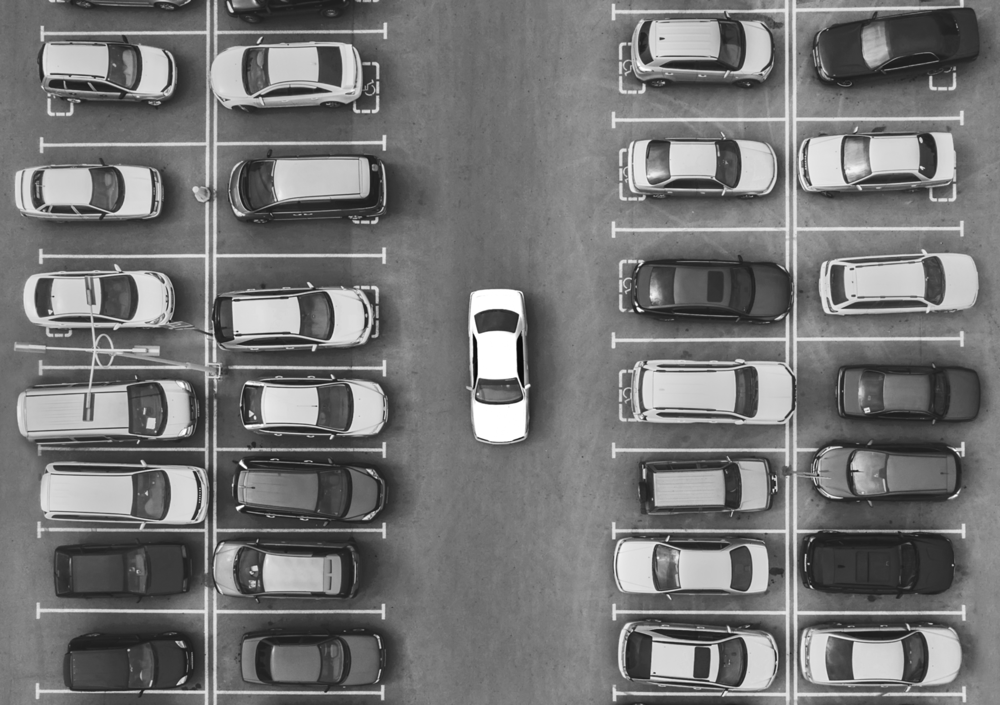
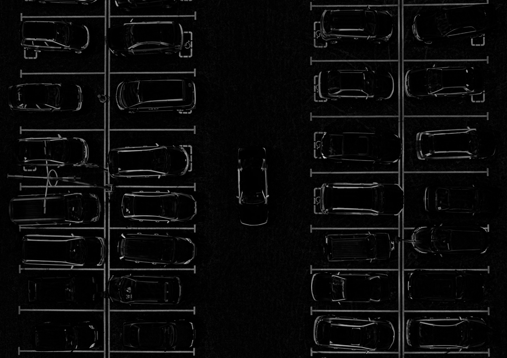
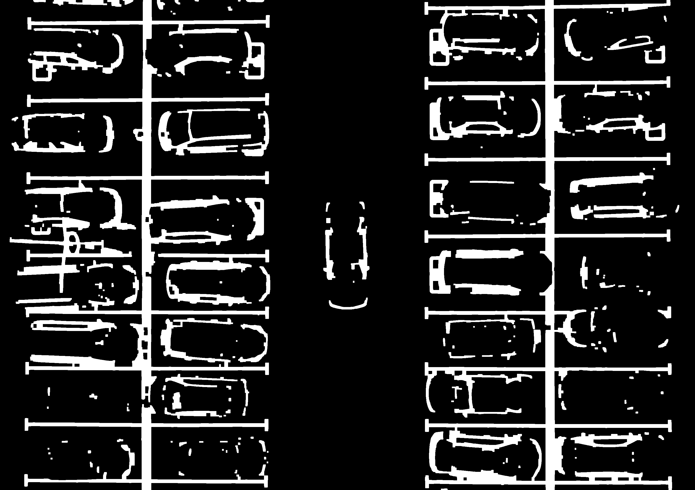

# Mini Project 2 - Object Counting

## Mata Kuliah Pengolahan Citra dan Video

**Nama :** Atika Najwa Azzahra
**NRP :** 5024241091

---

# 1. Identitas Project

**Target Objek :** Mobil pada area parkir (Aerial View)

**Jumlah Mobil Terdeteksi :** 27 Mobil

**Library yang Digunakan :**
- OpenCV (cv2)
- NumPy
- Matplotlib

---

# 2. Struktur Project

```text
mp2-object-counting/
├── README.md
├── counting.py
├── input/
│   └── parking.jpg
└── output/
    ├── result.png
    └── steps/
        ├── 1_original.png
        ├── 2_value_channel.png
        ├── 3_blur.png
        ├── 4_top_hat.png
        ├── 5_threshold.png
        ├── 6_morphology.png
        └── pipeline_visualization.png
```

---

# 3. Penjelasan Pipeline

Pada mini project ini digunakan metode segmentasi citra berbasis thresholding yang dikombinasikan dengan operasi morfologi untuk mendeteksi dan menghitung jumlah mobil pada area parkir.

## a. Konversi HSV dan Pengambilan Value Channel

Citra terlebih dahulu dikonversi dari BGR ke HSV. Setelah itu diambil channel Value (V) yang merepresentasikan tingkat kecerahan pada gambar.

```python
hsv = cv2.cvtColor(img, cv2.COLOR_BGR2HSV)
value = hsv[:, :, 2]
```

Channel Value dipilih karena mampu menonjolkan perbedaan intensitas antara mobil dan area aspal sehingga proses segmentasi menjadi lebih mudah.

---

## b. Gaussian Blur

Setelah itu dilakukan Gaussian Blur untuk mengurangi noise pada citra.

```python
blur = cv2.GaussianBlur(value, (5,5), 0)
```

Tahap ini membantu menghaluskan detail kecil yang tidak diperlukan sehingga hasil threshold menjadi lebih stabil.

---

## c. Top-Hat Transform

Operasi Top-Hat digunakan untuk menonjolkan objek yang lebih terang dibandingkan background di sekitarnya.

```python
top_hat = cv2.morphologyEx(
    blur,
    cv2.MORPH_TOPHAT,
    kernel_top
)
```

Pada tahap ini bentuk mobil mulai terlihat lebih jelas dibandingkan permukaan aspal.

---

## d. Thresholding (Otsu)

Setelah Top-Hat dilakukan proses thresholding menggunakan metode Otsu.

```python
_, mask = cv2.threshold(
    top_hat,
    0,
    255,
    cv2.THRESH_BINARY + cv2.THRESH_OTSU
)
```

Metode Otsu digunakan karena dapat menentukan nilai threshold secara otomatis berdasarkan histogram citra.

---

## e. Morphological Operations

Setelah thresholding dilakukan operasi morphology closing dan dilasi.

```python
mask = cv2.morphologyEx(
    mask,
    cv2.MORPH_CLOSE,
    kernel,
    iterations=3
)
```

Tujuannya adalah menyatukan bagian-bagian mobil yang masih terpisah sehingga menjadi satu objek yang lebih utuh.

---

## f. Contour Detection

Objek kemudian dicari menggunakan contour detection.

```python
contours, _ = cv2.findContours(
    mask,
    cv2.RETR_EXTERNAL,
    cv2.CHAIN_APPROX_SIMPLE
)
```

Setiap contour yang ditemukan dianggap sebagai kandidat objek mobil.

---

## g. Filtering

Tidak semua contour merupakan mobil sehingga dilakukan filtering berdasarkan:

### Area

```python
MIN_AREA = 700
MAX_AREA = 10000
```

Digunakan untuk membuang noise kecil dan objek yang terlalu besar.

### Aspect Ratio

```python
MIN_RATIO = 0.4
MAX_RATIO = 2.5
```

Digunakan untuk memastikan bentuk objek menyerupai mobil dari tampak atas.

---

# 4. Visualisasi Tahapan

Berikut adalah hasil dari setiap tahap pemrosesan citra.

| Tahap | Gambar |
|--------|--------|
| Original |  |
| Value Channel |  |
| Gaussian Blur |  |
| Top Hat |  |
| Morphology |  |
| Result |  |

### Penjelasan Singkat

| Tahap | Deskripsi |
|--------|--------|
| Original | Citra parkiran asli yang digunakan sebagai input. |
| Value Channel | Channel V dari HSV yang berisi informasi kecerahan. |
| Gaussian Blur | Mengurangi noise agar proses segmentasi lebih stabil. |
| Top Hat | Menonjolkan objek yang lebih terang dari background. |
| Morphology | Menyatukan bagian objek yang masih terpisah. |
| Result | Hasil akhir deteksi mobil menggunakan bounding box hijau. |

---

# 5. Hasil Deteksi

Berdasarkan hasil pengujian pada citra parkiran yang diberikan, program berhasil mendeteksi:

# 27 Mobil

Hasil akhir dapat dilihat pada file:

```text
output/result.png
```

---

# 6. Analisis

Berdasarkan hasil deteksi yang diperoleh, program berhasil mendeteksi sebanyak **27 mobil** pada citra area parkir.

Secara umum, sebagian besar mobil berhasil dideteksi dan diberikan bounding box dengan baik. Mobil berwarna putih, silver, merah, maupun beberapa mobil berwarna gelap masih dapat dikenali oleh sistem setelah melalui proses Top-Hat Transform, Thresholding, dan Morphological Operations.

Namun dari hasil yang diperoleh masih terdapat beberapa kendala.

### 1. Satu Mobil Terdeteksi Lebih Dari Satu Bounding Box

Pada beberapa mobil terlihat terdapat lebih dari satu bounding box yang muncul pada objek yang sama. Hal ini terlihat pada beberapa mobil berwarna putih dan biru yang memiliki kotak hijau kecil di bagian tertentu mobil.

Masalah ini terjadi karena setelah proses thresholding, beberapa bagian mobil seperti atap, kaca, atau pantulan cahaya terdeteksi sebagai area yang berbeda sehingga menghasilkan lebih dari satu contour.

Akibatnya terdapat kemungkinan jumlah mobil yang terdeteksi sedikit lebih besar dibanding jumlah mobil sebenarnya.

### 2. Ukuran Bounding Box Belum Selalu Menutupi Seluruh Mobil

Pada beberapa mobil, bounding box yang terbentuk hanya menutupi sebagian area mobil dan belum mencakup seluruh badan mobil.

Hal ini disebabkan karena contour yang terbentuk berasal dari area dengan intensitas tertentu saja, sehingga tidak semua bagian mobil ikut masuk ke dalam objek hasil segmentasi.

### 3. Garis Parkir Masih Mempengaruhi Hasil Segmentasi

Pada hasil Top-Hat dan Morphology terlihat bahwa garis parkir berwarna putih masih ikut muncul pada hasil segmentasi karena memiliki tingkat kecerahan yang tinggi.

Meskipun sebagian besar tidak terdeteksi sebagai mobil karena sudah difilter menggunakan area dan aspect ratio, keberadaan garis parkir tetap mempengaruhi bentuk contour yang dihasilkan.

### Evaluasi Hasil

Berdasarkan hasil pengujian, metode yang digunakan sudah mampu mendeteksi sebagian besar mobil pada area parkir tanpa menggunakan machine learning maupun deep learning.

Tahapan HSV Value Channel, Top-Hat Transform, Otsu Thresholding, dan Morphological Operations cukup membantu dalam memisahkan objek mobil dari background aspal.

Program berhasil mendeteksi sebanyak **27 mobil**, sehingga hasil yang diperoleh sudah cukup baik untuk pendekatan berbasis pengolahan citra digital.

### Pengembangan Selanjutnya

Beberapa perbaikan yang dapat dilakukan untuk meningkatkan akurasi deteksi antara lain:

- Menggabungkan contour yang saling berdekatan agar satu mobil tidak terdeteksi menjadi beberapa objek.
- Menggunakan Edge Detection (Canny) untuk memperjelas batas objek mobil.
- Menggunakan Watershed Segmentation untuk memisahkan objek yang saling berdekatan.
- Melakukan tuning parameter morphology agar bentuk objek yang dihasilkan lebih mendekati bentuk mobil sebenarnya.

Secara keseluruhan, metode yang digunakan telah berhasil memenuhi tujuan mini project yaitu mendeteksi dan menghitung jumlah mobil pada citra area parkir menggunakan teknik pengolahan citra digital.
---

### Evaluasi Hasil

Dari hasil yang diperoleh, metode yang digunakan sudah mampu mendeteksi sebagian besar mobil tanpa menggunakan machine learning maupun deep learning.

Program berhasil mendeteksi sebanyak 27 mobil secara tidak begitu akurat karena masih terdapat beberapa kasus over-detection karena satu mobil dapat menghasilkan lebih dari satu contour.

---

### Pengembangan Selanjutnya

Beberapa metode yang dapat digunakan untuk meningkatkan akurasi:

- Adaptive Thresholding
- Watershed Segmentation
- Connected Component Analysis
- Contour Merging
- Edge Detection (Canny)
- Non Maximum Suppression (NMS)

Metode tersebut dapat membantu mengurangi kasus satu mobil terdeteksi menjadi beberapa bounding box.

---

# 7. Cara Menjalankan Program

Install library yang dibutuhkan:

```bash
pip install opencv-python numpy matplotlib
```

Pastikan file gambar berada pada folder:

```text
input/parking.jpg
```

Jalankan program:

```bash
python counting.py
```

Hasil akhir akan tersimpan pada:

```text
output/result.png
```

Sedangkan visualisasi tahapan pemrosesan citra tersimpan pada:

```text
output/steps/
```
